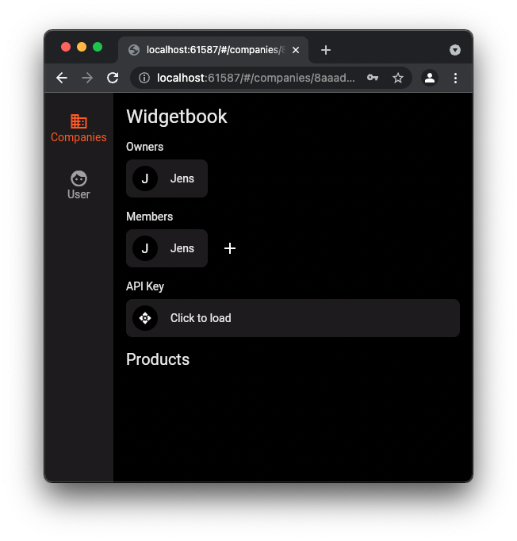

# Widgetbook Hosting

The Widgetbook Hosting docker image allows Widgetbook Cloud user to upload the widgetbook version which has been uploaded to GitLab. 

# Setup 

Before the web version of your Widgetbook can be upload to the collaboration platform you need to build the web app first. You know best how to build you app but your build action might look like this:

```yaml
stages:
  - compile

compile:
  stage: compile
  image: "cirrusci/flutter:2.8.1"

  before_script:
    - export PATH="$PATH":"$HOME/.pub-cache/bin"
  script:
    - flutter build web -t lib/main.widgetbook.dart
  artifacts:
    paths:
    - build/web/
```

By running this script, a folder structure `./buid/web/` with the widgetbook web app will be created. The output folder of the build is required by the Widgetbook Hosting action and will be uploaded to the collaboration platform. Since the hosting stage requires the build output, it'll be exposed by the stage via an artifact. 

## Environment variables

The docker image reads git specific information like branch name, repository name, etc from the environment variables but also requires two mandatory environment variables provided by the user.

### `WIDGETBOOK_BUILD_PATH`

**Required** The path to the web build of the widgetbook. For small repositories this is likely `build/web/`


### `WIDGETBOOK_API_KEY`

**Required** The API key for your company.

See how to create an API key for more information.

## How to create an API key

To create an API key, you need to login with your account at [app.widgetbook.io](https://app.widgetbook.io). API keys are bound to companies. Therefore, you require a company to retrieve an API key. Furthermore, only users with the `Company Owner` role can fetch the API keys of a company. 

> **Alpha Version:** For now, the only way to become a `Company Owner` is to create a new company.

As a user you can create a new company by clicking the add button. 


> **Alpha Version:** After the company is create you need to logout and then login again. After you logged in again you can view the details of the company.

On the detail page of a company, a card which allows to fetch the API key is displayed. 



Click the card to fetch the API key. The key will be copied to your clipboard.


# Example Usage 

The docker image is provided at Docker Hub and is named `widgetbook-hosting-gitlab`. 
You can access the executable by calling `/widgetbook-hosting`. 

```yaml
stages:
  - compile
  - host

compile:
  stage: compile
  image: "cirrusci/flutter:2.8.1"

  before_script:
    - export PATH="$PATH":"$HOME/.pub-cache/bin"
  script:
    - flutter build web -t lib/main.widgetbook.dart
  artifacts:
    paths:
    - build/web/

host: 
  stage: host
  variables:
    WIDGETBOOK_API_KEY: "<api key>"
    WIDGETBOOK_BUILD_PATH: "build/web"
  image: 
    name: widgetbook/widgetbook-hosting-gitlab:dev
  script:
    - /widgetbook-hosting
```